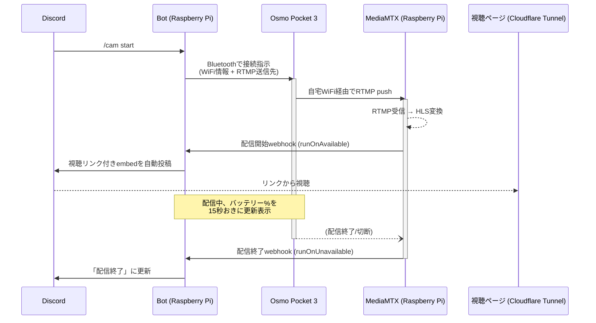

# dji-cam-discord

DJI Osmo Pocket 3 の映像を、スマホの DJI Mimo アプリを使わずに自宅の Raspberry Pi 経由で受信し、配信の開始・終了を Discord に自動通知する個人プロジェクトです。

Discord で `/cam start` を叩くだけで、カメラの WiFi 接続・配信開始・視聴リンクの共有まで自動化されています。

## 背景

「DJI mimo アプリでスマホから見ているカメラ映像を、Discord で家族/友人に配信したい」という要望から始まったプロジェクトです。DJI の消費者向けカメラには PC/サーバー向けの公式 SDK が存在しないため、コミュニティによるリバースエンジニアリングツール([djictl](https://github.com/xaionaro-go/djictl))を使い、Bluetooth 経由でカメラを直接制御する構成にしています。

## 仕組み



スマホやDJI Mimoアプリは一切使いません。ラズパイがBluetoothでカメラに直接「WiFiに繋いで配信を開始しろ」と指示し、カメラは自宅WiFi経由でラズパイのRTMPサーバーへ直接映像を送ります(映像データ自体は`djictl`プロセスを経由せず、Bluetoothは制御指示のみに使われます)。

## 主な機能

- **`/cam start`** — カメラに WiFi 接続 + RTMP 配信開始を指示。数秒〜数十秒後に自動で配信開始が通知される
- **`/cam stop`** — 配信制御プロセスを停止
- **配信開始/終了の自動通知** — MediaMTX が RTMP の生死を検知し、Discord に視聴リンク付きで自動投稿(手動での画面共有は不要)
- **バッテリー残量のリアルタイム表示** — 配信中、15秒おきに埋め込みメッセージが更新される
- **画質の調整** — `/cam start resolution:720p bitrate_kbps:3000 fps:30` のようにオプション指定可能。自宅 WiFi の電波状況に応じて調整できる
- **チャンネル/サーバーの固定設定が不要** — スラッシュコマンドはグローバル登録、通知先チャンネルは直近で `/cam start` を実行した場所を自動で記憶する

## 技術スタック

| 役割 | 技術 |
|---|---|
| Discord Bot | Node.js + discord.js v14 |
| カメラ制御(Bluetooth) | [djictl](https://github.com/xaionaro-go/djictl)(Go製、コミュニティのリバースエンジニアリングツール) |
| RTMP受信・HLS変換 | [MediaMTX](https://github.com/bluenviron/mediamtx) |
| 外部公開 | Cloudflare Tunnel(Quick Tunnel、独自ドメイン不要) |
| 実行環境 | Raspberry Pi 4(systemd常駐) |

## セットアップ

実機での構築手順(Go/djictlのビルド、MediaMTX導入、Cloudflare Tunnel設定、systemd化など)は [`deploy/NOTES.md`](deploy/NOTES.md) に詳細を記載しています。アプリ全体の設計・既知の制約は [`CLAUDE.md`](CLAUDE.md) を参照してください。

```
cd bot
npm install
cp .env.example .env   # 環境変数を編集
node deploy-commands.js  # スラッシュコマンド登録
node index.js
```

## 既知の制限事項

- Osmo Pocket 3 の Bluetooth 接続は同時に1台のみ。DJI Mimo アプリと同時利用はできない
- `djictl` はコミュニティによるリバースエンジニアリングツールのため、DJI 側のファームウェア更新で動作しなくなるリスクがある
- バッテリー残量は取得できるが、録画中フラグなど他のステータス情報は現状のOSSツールでは未対応
- Cloudflare Quick Tunnel の公開URLはトンネル再起動のたびに変わる(固定したい場合は独自ドメインでの named tunnel が必要)

## 今後のアイデア

- 配信断の自動検知・再通知(現状はバッテリー切れ/WiFi切断時に無言で止まる)
- カメラの電源ONを自動検知して配信を自動開始
- 独自ドメインでの視聴URL固定化
